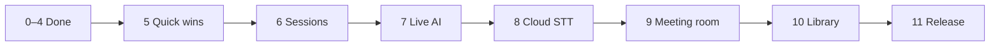

# Ude — Master phase plan

**Product:** Privacy-first meeting & voice assistant — capture → transcribe → AI → **organize and follow up** (without full Notion/Monday PM scope).

**Vision thread:** [Grok: AetherMind vs Pocket AI](https://grok.com/share/bGVnYWN5LWNvcHk_f99dbc47-1e48-455a-bd8b-a29dfbf45b8f) · **Detail:** [ROADMAP.md](ROADMAP.md)

---

## Status at a glance

| Phase | Name | Status | Est. |
|-------|------|--------|------|
| **0** | Base & Capacitor | ✅ Done | — |
| **1** | Voice & Listen | ✅ Done | — |
| **2** | AI (Functions) | ✅ Done | — |
| **3** | Notes, todos, dashboard | ✅ Done | — |
| **4** | Settings & polish | ✅ Done | — |
| **5** | Quick wins | ✅ Done | 0.5–1 day |
| **6** | Meeting sessions | ✅ Done | 1–2 days |
| **7** | Live AI & tags | ✅ Done | 1–2 days |
| **8** | Meeting-grade STT | ✅ Done | 3–5 days |
| **9** | Post-meeting workspace | ✅ Done | 3–4 days |
| **10** | Library & export | ✅ Done | 1–2 days |
| **11** | Android production | ✅ Done | 2–4 days |

---

## Phase 0 — Base & Capacitor ✅

- [x] Next.js static export + Capacitor Android (`out/`, `capacitor.config.ts`)
- [x] Firebase web config (`.env.local`), Anonymous auth path
- [x] Functions scaffold, secrets pattern (`defineSecret`, `.secret.local`)
- [x] `RECORD_AUDIO`, `WAKE_LOCK` in Android manifest
- [x] Docs: PHASE0, CAPACITOR, EMULATORS (JDK 21+)
- [x] No PWA (by design)

**Doc:** [PHASE0.md](PHASE0.md)

---

## Phase 1 — Voice & transcription ✅

- [x] Web Speech wrapper (`lib/speech/web-speech.ts`) — continuous, interim, finals
- [x] Transcript merge (cumulative finals, line breaks on pause)
- [x] `use-speech-recognition`, Listen page, transcript panel
- [x] Wake lock while listening
- [x] Privacy: no `MediaRecorder` / no audio Blobs stored
- [x] Capacitor Android mic path (skip `getUserMedia` preflight on Android)

**Not in scope (deferred):** chunk audio every 5–10s to server; background listen.

**Doc:** [PHASE1.md](PHASE1.md)

---

## Phase 2 — AI service layer ✅

- [x] Firebase callable `aiProcess` (Gemini + Grok)
- [x] Client `aiService`: summarize, extract todos, mind map, generic
- [x] Keys only in Secret Manager / `.secret.local` (not `functions/.env` on deploy)
- [x] Public invoker for callable; error messages surfaced to client

**Doc:** [PHASE2.md](PHASE2.md)

---

## Phase 3 — Data & features ✅

- [x] Firestore `users/{uid}/notes`, `users/{uid}/todos`
- [x] IndexedDB local-first vault + sync
- [x] Dashboard, Notes (+ todos tab), save from Listen
- [x] Mermaid mind map on Listen
- [x] Todo due + Web Notifications reminder (1h)

**Not in scope (deferred):** FCM, separate Maps nav, Dexie (uses custom IndexedDB).

**Doc:** [PHASE3.md](PHASE3.md)

---

## Phase 4 — Settings & polish ✅

- [x] shadcn/ui, theme (light/dark/system)
- [x] Settings: AI provider, speech language, local-only, clear local data
- [x] Signed APK guidance

**Doc:** [PHASE4.md](PHASE4.md)

---

## Phase 5 — Quick wins (low bloat)

**Goal:** Immediate value on current Web Speech stack; no new collections required except optional tags on notes.

- [x] Privacy badge on Listen (“audio not stored”)
- [x] Copy transcript (markdown) to clipboard
- [x] Copy AI result button on Listen
- [x] Editable **title** when saving from Listen
- [x] **Tags** on save (chip input → `string[]` on note)
- [x] Filter Notes list by tag
- [x] Home card: **Open follow-ups** (incomplete todos)
- [x] **Continue last session** (`localStorage` transcript snapshot)
- [x] **⭐ Highlight** during listen (`{ id, text, note?, createdAt }` — anchors for Phase 9 appends)

**Exit criteria:** User can tag, copy, resume, and trust privacy copy without a Meeting entity yet.

---

## Phase 6 — Meeting sessions

**Goal:** First-class **Meeting** for capture workflow; still Web Speech.

### Data

- [x] `MeetingRecord`: `id`, `title`, `startedAt`, `endedAt`, `transcript`, `canonicalNoteId`, `tags[]`, `highlights[]`
- [x] Firestore `users/{uid}/meetings` + IndexedDB mirror
- [x] `NoteRecord` / todos: optional `meetingId` link

### Listen UI

- [x] **Start meeting** / **End meeting** (quick listen still available without a meeting)
- [x] On end: create **canonical note** (transcript preserved, not overwritten later)
- [x] Settings: auto **summarize + extract todos** on end (toggle)
- [x] Dashboard: **Recent meetings** list

### Compliance copy

- [x] Short consent reminder where required (“inform participants”)

**Exit criteria:** Real meeting on phone → End → canonical note + optional auto AI + todos.

---

## Phase 7 — Live AI, tags & voice commands

**Goal:** Pocket-AI-style assistance during/after capture (Grok Phase 5 items).

- [x] Optional **rolling summary** every N minutes while listening (settings)
- [x] **Smart tags** suggested by AI on meeting end (user confirms)
- [x] **Daily recap** card on home (yesterday’s meetings → open todos → 2‑min summary)
- [x] **Voice commands** from transcript phrases (“add todo: …”, “highlight”, “summarize so far”)
- [x] Light prompt: “Create N todos from this?” after extract

**Exit criteria:** Meeting feels “assisted,” not only post-hoc buttons.

---

## Phase 8 — Meeting-grade transcription ✅

**Goal:** Reliable long sessions, **speaker lines**, Starlink-friendly path.

- [x] **Meeting mode** in Settings: Browser speech vs **Cloud STT**
- [x] Audio chunks via `MediaRecorder` → `transcribeAudio` → Gemini multimodal STT
- [x] **Speaker diarization** → `segments[{ speakerId, text }]` → transcript lines + `Speaker N:` in saved text
- [x] Privacy copy: cloud mode badge + Settings; local-only forces browser speech
- [x] Blaze + billing via existing `GEMINI_API_KEY`

**Doc:** [PHASE8.md](PHASE8.md)

**Exit criteria:** 30–60 min meeting with Speaker 1/2 labels on home Wi‑Fi (where Web Speech failed).

---

## Phase 9 — Post-meeting workspace ✅

**Goal:** Follow-up tools after the meeting — **linked appends**, topics, follow-ups — light Notion/Monday, not full PM.

### Core rules

- **Canonical meeting record** is never replaced by appends.
- **Appends** are separate records: `parentMeetingId`, `body`, optional `anchor` → `segmentId` | `topicId` | `highlightId`.

### Data

- [x] `MeetingAppendRecord` (+ local/Firestore `meetingAppends`)
- [x] `speakers[]` user-editable (`id`, `displayName`)
- [x] `topics[]` (AI-suggested + user edit)
- [x] Extend todos: `topicTag`, `assigneeLabel`, `status`: `open` | `waiting` | `done`

### UI — Meeting room (`/meetings/?id=` + `&tab=`)

| Tab | Deliverables |
|-----|----------------|
| **Transcript** | Segment list; reassign speaker; canonical read-only block |
| **Summary** | AI summary; user editable |
| **Your notes** | Timeline of **linked appends**; add append with optional anchor |
| **Script** | Agenda before; polished minutes/narrative after |
| **Follow-ups** | Todos for this meeting; add manual; status |
| **Topics** | Topics list; tag follow-ups by topic |
| **Ask** | Chat scoped to this meeting |

### AI assists

- [x] Suggest topics (`suggest_topics`)
- [x] AI polish minutes (`meeting_minutes`)
- [x] Meeting-scoped Ask (context bundle)
- [ ] Highlights → follow-ups one-click (Phase 10+)
- [ ] “Open items from last meeting with tag X” (Phase 10)

**Doc:** [PHASE9.md](PHASE9.md)

**Exit criteria:** User can run a meeting, append linked notes to sections, manage follow-ups by topic/tag, ask questions about that meeting.

---

## Phase 10 — Library, templates & export ✅

**Goal:** Find and reuse conversations; share out.

- [x] **Library** (`/library/`): filter by **tag**, **topic**, open follow-ups
- [x] Meeting **templates** (1:1, Client call, Standup) → title, tags, agenda on start
- [x] **Series**: same-tag meetings; open follow-ups from prior meetings in Library + Listen hint
- [x] **Export Markdown** in meeting room (transcript + summary + appends + follow-ups)
- [x] 3-column **follow-ups board** (`/library/?view=board`)

**Doc:** [PHASE10.md](PHASE10.md)

**Stop short of:** Notion sync, wiki, multi-user workspaces, Gantt, automations.

**Exit criteria:** User can find meetings by tag and paste a full export into email/Notion.

---

## Phase 11 — Android production & reliability ✅

**Goal:** Trustworthy daily driver on device.

- [x] Foreground service + persistent notification while recording (`RecordingForegroundService`)
- [x] **FCM** token registration + **local notifications** for todos (push delivery requires `google-services.json` + server send)
- [x] Onboarding: mic, notifications, privacy (`/onboarding/`)
- [x] Signed release APK / Play-ready checklist — [ANDROID_RELEASE.md](ANDROID_RELEASE.md)
- [ ] Optional: calendar read-only → meeting title/time (v2)
- [x] Network doc: [NETWORK_TROUBLESHOOTING.md](NETWORK_TROUBLESHOOTING.md)

**Doc:** [PHASE11.md](PHASE11.md)

**Exit criteria:** Screen-off or switched-app behavior documented; push works on Android; release build tested on device.

---

## Out of scope (v2+)

- Team workspaces, sharing, permissions
- Two-way Notion/Monday sync
- Full kanban / portfolio PM
- CRM, time tracking, dependencies, Gantt
- Always-on background ambient listen (unless Phase 11 foreground proves insufficient)

---

## Definition of done — Ude v1

You can ship v1 when:

1. **Phase 6–8** — Meeting capture end-to-end with speakers (or acceptable Web Speech fallback labeled “quick mode”).
2. **Phase 9** — Meeting room with **linked appends** (not merged into original), follow-ups, topics/tags.
3. **Phase 10** — Find by tag + export minutes.
4. **Phase 11** — Android recording UX + FCM + signed APK.

Phases **0–11** ✅ — Ude v1 feature-complete for single-user release.

---

## Per-phase docs (implementation detail)

| Phase | Doc |
|-------|-----|
| 0–4 | [PHASE0](PHASE0.md) … [PHASE4](PHASE4.md) |
| 5–8 | [PHASE5](PHASE5.md) … [PHASE8](PHASE8.md) |
| 9 | [PHASE9.md](PHASE9.md) |
| 10 | [PHASE10.md](PHASE10.md) |
| 11 | [PHASE11.md](PHASE11.md) |
| Emulators | [EMULATORS.md](EMULATORS.md) |
| Android | [CAPACITOR.md](CAPACITOR.md), [ANDROID_SSL.md](ANDROID_SSL.md) |
