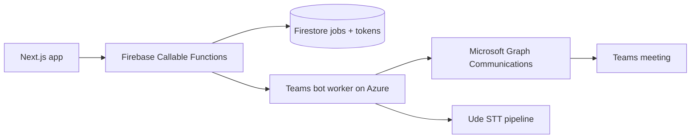

# Teams calling bot (Option 2)

**User-facing UI is off by default** (`NEXT_PUBLIC_TEAMS_BOT_INTEGRATION_ENABLED` is unset). Settings shows “Coming soon”; the rest of the app is unaffected. Set the env var to `true` when Entra + worker are ready.

Ude’s Otter-style path for **Microsoft Teams**: a disclosed bot participant joins the meeting and streams mixed audio to cloud STT. Firebase Functions orchestrate OAuth, quotas, and job dispatch; a **separate Azure worker** implements Graph Cloud Communications.

## Architecture



| Piece | Repo location | Role |
|-------|---------------|------|
| OAuth + quotas | `functions/src/integrations/microsoft/` | User connects Microsoft; Pro/Power limits |
| Client UI | `components/settings/microsoft-teams-integration.tsx` | Connect, queue joins |
| Worker | `services/teams-bot-worker/` (deploy separately) | Join call, media, webhooks |

## Entra (Azure AD) app

1. **App registration** in Microsoft Entra ID.
2. **Redirect URI** (SPA or Web):  
   `https://<your-host>/integrations/microsoft/callback/`  
   (and `http://localhost:3000/...` for local dev if used).
3. **Delegated permissions** (admin consent for tenant):
   - `openid`, `profile`, `offline_access`
   - `User.Read`
   - `OnlineMeetings.Read`
   - `Calendars.Read` (Power calendar auto-join later)
4. **Client secret** for the Functions backend token exchange.

## Firebase secrets (when launching Teams bot)

**Deploy works without these** — `handlers.ts` does not bind Microsoft secrets until you uncomment `microsoftSecretsForDeploy` in `functions/src/integrations/microsoft/config.ts` and `callOptions.secrets`.

When ready:

```bash
firebase functions:secrets:set MICROSOFT_CLIENT_ID
firebase functions:secrets:set MICROSOFT_CLIENT_SECRET
firebase functions:secrets:set MICROSOFT_TENANT_ID   # use "common" value or tenant GUID
firebase functions:secrets:set TEAMS_BOT_WORKER_BASE_URL   # e.g. https://teams-bot.example.com
```

Uncomment `defineSecret` + bind `secrets: [...microsoftSecretsForDeploy]` in `handlers.ts`, then redeploy Functions.

## Bot worker (Azure)

The worker is **not** in the Next.js bundle. Use Microsoft’s calling samples (e.g. bot-calling-meeting, .NET) on App Service or Container Apps:

- Azure Bot registration + messaging endpoint
- Graph application permissions for calls (tenant admin)
- HTTPS webhook for call state and media

Worker contract (v1):

- `POST {TEAMS_BOT_WORKER_BASE_URL}/jobs/{jobId}/dispatch` — body includes Firestore job id; worker reads job metadata from a shared secret or callback to Functions.

See `services/teams-bot-worker/README.md`.

## Plan limits (Pro vs Power)

Configured in `lib/plan/config-schema.ts` / Firestore `adminConfig/plan`:

| Tier | Bot | Minutes/mo | Joins/mo | Calendar auto-join |
|------|-----|------------|----------|------------------|
| Free | Off | — | — | — |
| Pro | On | 600 | 30 | No |
| Power | On | 2400 | 120 | Beta flag |

Usage counters: `usageMonthly/{uid}` fields `teamsBotMinutes`, `teamsBotJoins`.

## Product disclosure

Hosts should announce that a **transcription bot** joined. The UI states this when queuing a join. This is not a covert recorder.

## Troubleshooting

| Symptom | Check |
|---------|--------|
| “Microsoft sign-in is not configured” | Secrets missing on Functions |
| Join queued, never joins | `TEAMS_BOT_WORKER_BASE_URL` empty or worker down |
| Quota errors | Plan, `usageMonthly`, estimated minutes on join |
| OAuth redirect mismatch | Entra redirect URI must match `microsoftOAuthRedirectUri()` exactly |
